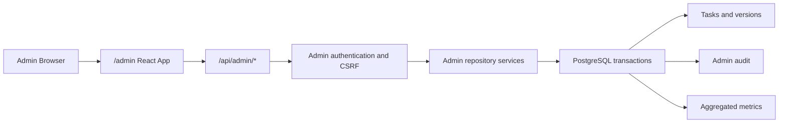

# Admin Dashboard 与管理能力实施计划

> 状态：MVP 已实现，精确 active timer 与 reviewer 工作流待后续迭代
> 最后更新：2026-08-28
> 适用项目：Egyptian Arabic Annotation Tool v5（Flask + PostgreSQL）

> 落地说明：为保持现有零构建部署，MVP 最终采用隔离的原生
> `admin.html/admin.css/admin.js`，没有引入 React 构建链；其余独立权限域、不可变
> baseline、原子撤销/停用、质量信号和审计设计均已实现。

## 1. 目标

为现有音频标注平台增加一个需要独立密钥登录的 Admin 控制台，并提供：

- 可按日期、标注员、状态、folder、category 筛选的全局 Dashboard。
- 全量语料、标注进度、音频时长、任务池健康度统计。
- 每位标注员的产能、效率、标签分布和质量信号。
- 标注记录明细查看、单条撤销和批量撤销。
- 停用标注员，并回收其当前任务及仍然有效的标注成果。
- 完整、可查询的应用级管理员操作审计；数据库角色隔离与防篡改存储作为生产加固项。

本计划的首要原则是：**撤销不物理删除历史，删除标注员不物理删除身份，所有任务状态变更均由数据库事务完成。**

## 2. 当前系统结论

当前项目没有 SPA 或前端构建体系，页面由 Flask 显式返回三个自包含 HTML：

- `index.html`：标注工作台。
- `completed.html`：标注员个人完成记录。
- `login.html`：无密码用户名登录及公开排行榜。
- `server.py`：页面、API 和媒体授权。
- `annotation_repository.py`：业务事务、统计和权限规则。
- `migrations/001_initial.sql`：任务、版本、assignment、operation 和 event 数据模型。

已有能力：

- PostgreSQL 原子领取及并发控制。
- 版本化 annotation、revision 和 published 数据。
- `annotation_events` 审计事件。
- `operation_id` 幂等控制。
- 当前任务池统计和轻量排行榜。
- CLI 管理员释放 assignment。

主要缺口：

- 没有 Admin principal、Admin Session 或 Admin API。
- 当前标注员登录会自动创建任意用户名，不适合高权限身份。
- 没有按日期的完整聚合查询和标注员详情查询。
- 没有撤销已发布标注并重建可领取任务的事务。
- 没有不可变的预处理 baseline。
- 没有准确的活跃标注时长，只能估算领取到提交的周转时间。
- 多处外键引用 `annotators`，不能安全物理删除标注员。

## 3. 已确定的核心设计

### 3.1 独立权限域

Admin 页面和接口使用独立路由、身份、Session 和安全策略：

```text
/admin/login
/admin
/api/admin/*
```

Admin 认证不得复用 `/api/login`、普通标注员 Session 或 Flask `secret_key`。

### 3.2 软删除标注员

产品界面可显示“删除标注员”，数据库语义为 `deactivated`：

- 立即禁止登录和继续写入。
- 吊销活动 Session。
- 回收当前 assignment。
- 撤销该用户仍为当前有效版本的提交。
- 保留 username、version、event 和 operation 作为审计证据。

### 3.3 撤销而非删除标注

撤销只撤下当前有效 published version：

- 原 version 和 segments 永久保留。
- version 标记为 `revoked`。
- task 恢复为 `pending`。
- 从不可变 baseline 创建干净 draft。
- 写 Admin action 和逐任务审计项。
- 默认阻止原提交者再次领取该任务。

### 3.4 双统计口径

Dashboard 同时提供：

- **历史活动量**：基于 `completed`、`revoked_admin` 等不可变事件，反映实际发生过的工作。
- **当前有效语料**：基于 `current_published_version_id`，反映当前可以导出和训练的数据。

撤销会降低当前有效语料，但不会重写过去的历史活动曲线。

### 3.5 速度指标分层

- 第一版可展示领取到提交的 wall-clock 周转时间，并明确标注“包含空闲时间”。
- 准确速度需要新增 active timer，只累计页面可见且近期存在键鼠、编辑或播放活动的时间。
- 标准化速度定义为：`音频时长 / 活跃标注时间`。

## 4. 目标架构



### 4.1 Admin 前端

推荐新建隔离的 React + TypeScript + Vite 应用，不迁移或重写现有标注页。

建议依赖：

- Radix UI：Dialog、Dropdown、Popover、Tabs 等可访问基础组件。
- TanStack Query：请求缓存、错误和加载状态。
- TanStack Table：服务端筛选、排序、选择和分页。
- Apache ECharts：趋势、堆叠、分布和比例图。
- Lucide Icons：统一图标。

构建产物由 Flask 静态提供。依赖必须锁版本并随部署构建，生产环境不直接使用第三方 CDN。

若后续决定保持零 Node 运维，可降级为模块化 `admin.html + admin.css + admin.js`，但不应再创建一个包含全部 CSS/JS 的超大内联 HTML。

### 4.2 视觉方向

借鉴 OpenAI Platform 的信息密度和层级，而非像素级复制：

- 固定窄侧栏、顶部上下文和时间筛选。
- 灰白中性色、1px 浅边框、低阴影。
- 单一低饱和强调色。
- 红色仅用于危险操作和错误。
- 紧凑表格、明确空状态和 Skeleton。
- 图表可点击下钻到带相同筛选条件的任务表。
- 筛选条件同步到 URL，刷新和分享链接后仍可恢复视图。

## 5. 信息架构与页面

### 5.1 左侧栏

- Overview
- Annotators
  - 可搜索的全量标注员列表
  - active/deactivated 状态
  - 当前是否在线或持有任务
- Tasks / Corpus
- Review & Quality
- Activity Log
- Settings

### 5.2 全局筛选

- 快捷日期：7 天、30 天、90 天、全部。
- 自定义开始/结束日期和时间。
- 时区。
- 标注员。
- task status。
- folder。
- category。
- 刷新和 CSV 导出。
- 数据更新时间。

日期 API 使用 `[from, to)` 半开区间和明确时区；服务端负责日/周分桶，避免浏览器本地日期边界误差。

### 5.3 Overview

首屏 KPI：

- 总音频数、总音频时长。
- 已标注数/时长。
- 已跳过数/时长。
- Pending 总数/时长。
- Pending 分解：assigned、available、reserved、eligible=false。
- 可训练 segment 数量/时长。
- 最近 24 小时、7 天活跃标注员。
- 7 日平均产能及相对上一周期变化。
- 预计完成日期。

图表：

- 每日 Annotated / Skipped / Revoked 数量。
- 每日产出音频时长、可训练时长。
- 累计完成率和 backlog burn-down。
- 状态漏斗。
- folder/category 覆盖度。
- skip reason 分布。
- Bad quality segment 数量比例和时长比例。
- 队列健康：最老 Pending、长期占用、孤立 draft、无 segment。

### 5.4 Annotator Detail

摘要指标：

- 当前有效贡献任务数和音频时长。
- 历史提交动作数。
- Annotated / Skipped。
- 可训练 segment 时长。
- 活跃天数、最后活跃时间。
- 平均、中位、P90 周转时间。
- 活跃标注时间和标准化速度（active timer 上线后）。
- revision、abandon、Admin revoke 次数。

图表：

- 每日任务数和音频时长。
- 周转时间或每音频分钟耗时分布。
- skip reason 比例。
- Bad quality segment 数量和时长比例。
- folder/category 分布。
- ASR 文本修改幅度；只作为异常信号，不直接称为质量分。

任务表：

- 文件名、folder、category。
- 音频时长、segment 数。
- 状态、skip reasons。
- Bad quality 数量和比例。
- 提交时间、revision、周转时间。
- 当前是否仍为有效 published version。
- View、Revoke、批量选择。

### 5.5 Quality

首期没有正式 Reviewer workflow，先提供规则型质量信号：

- 超快或超慢任务。
- 单个标注员 skip/Bad quality 比例显著偏离团队。
- 空文本、非法或重叠时间区间。
- 修订率和 Admin 撤销率。
- 随机抽样待检查列表。

后续可扩展 Accept、Reject、Fix + Accept、Ground Truth 和 inter-annotator agreement。

### 5.6 Activity Log

支持按时间、动作、标注员、task、Admin Key ID 筛选：

- Admin 登录成功/失败。
- 单条/批量撤销。
- 恢复。
- assignment release。
- 标注员停用。
- 导出。
- 失败、冲突和幂等重放结果。

## 6. 数据库迁移

新增 `migrations/002_admin.sql`，不得修改已经应用的 `001_initial.sql`。

### 6.1 Annotator 状态

给 `annotators` 增加：

```text
status                 active | deactivated
deactivated_at         TIMESTAMPTZ NULL
deactivated_reason     TEXT NULL
```

以下路径必须统一检查 `status='active'`：

- login 和 validate session。
- claim、save、complete、abandon、reopen。
- heartbeat。

### 6.2 不可变 baseline

给任务增加：

```text
baseline_version_id   UUID NULL
baseline_quality      exact | reconstructed | reprocessed
```

扩展 `annotation_versions.lifecycle`：

```text
baseline | draft | published | superseded | abandoned | revoked
```

约束：

- 每个 task 最多一个 baseline。
- baseline segments 不允许普通保存接口修改。
- 撤销和重置必须从 baseline 克隆新 draft，不能克隆被撤销的答案。

### 6.3 Admin Session

新增 `admin_sessions`：

```text
id
key_id
token_digest
csrf_digest
created_at
last_seen_at
idle_expires_at
absolute_expires_at
revoked_at
ip_hash
user_agent
```

数据库只保存随机 Session token 的摘要，不保存 Admin Key 明文。

### 6.4 Admin 审计

新增 `admin_actions`：

```text
id / operation_id
admin_session_id
action_type
reason
request_hash
status
request JSONB
summary JSONB
created_at
completed_at
```

新增 `admin_action_items`：

```text
admin_action_id
task_id
annotator_id
expected_version_id
before_version_id
result
details JSONB
```

现有 `annotation_events.operation_id` 具有唯一约束，一个批量 operation 不能安全复用同一个 operation ID 写多个 event，因此需要独立 action/items 模型。可再给 `annotation_events` 增加 `admin_action_id` 关联。

### 6.5 撤销元数据

给 `annotation_versions` 增加：

```text
revoked_at
revoked_reason
revoked_by_admin_action_id
```

被撤销版本不得原地改回 draft。

### 6.6 防止原用户重领

新增 `task_annotator_blocks`：

```text
task_id
user_id
reason
admin_action_id
created_at
```

claim 查询排除当前用户被 block 的任务。

### 6.7 活跃时长

准确速度阶段新增 `annotation_attempts`：

```text
id
user_id
task_id
version_id
mode
started_at
last_ping_at
active_seconds
ended_at
end_reason
```

前端仅在页面可见且近期发生键鼠、编辑或播放活动时发送 active ping。服务端对单次增量设置上限，避免离线后一次性补计。

### 6.8 查询索引

至少增加：

- `annotation_versions(submitted_at)` 的相关 partial index。
- `(submitted_by_user_id, submitted_at)`；如现有索引满足则复用。
- `annotation_events(event_type, created_at)`。
- `admin_action_items(task_id)`。
- `annotators(status, created_at)`。
- `task_annotator_blocks(user_id, task_id)`。

## 7. 历史 baseline 回填

当前首个 draft 会被直接人工修改并变成 published，因此历史数据无法百分之百恢复最初预处理边界。

回填规则：

1. 新进入系统的任务：保存精确、不可变 baseline，`baseline_quality=exact`。
2. 未人工修改的 pending draft：精确克隆为 baseline。
3. 已人工修改或 published 的历史任务：
   - 从最早可用 version 重建。
   - 保留 `asr_text`。
   - 清空 `text`。
   - 清除 `exclude_from_training`。
   - 保留当前可用时间边界。
   - 标记 `baseline_quality=reconstructed`。
4. 如果业务要求彻底去除人工边界，则离线重新运行 VAD/ASR，标记 `baseline_quality=reprocessed`。

回填必须生成审计报告：exact、reconstructed、reprocessed、failed 的任务数量及清单。未生成 baseline 的任务禁止执行 Admin revoke。

## 8. Admin 鉴权与安全

### 8.1 Key

- 使用至少 32 字节随机高熵 Key。
- 部署环境保存 `ANNOTATION_ADMIN_KEY_SHA256` 或等价摘要。
- 使用 `secrets.compare_digest` 常量时间比较。
- 未配置 Key 时 Admin 功能 fail closed。
- 不复用 Flask `secret_key`。
- 不将 Key 放入 URL、Cookie、localStorage、数据库或日志。
- 为未来多把 Key 保留 `key_id/name/status` 接口。

若使用人类可记忆的 passphrase，而不是随机 Key，应改用 Argon2id 等慢哈希方案。

### 8.2 Session

- 登录成功后签发独立随机 token。
- Cookie：`__Host-admin_session; Secure; HttpOnly; SameSite=Strict; Path=/`。
- 15–30 分钟 idle timeout。
- 8 小时 absolute timeout。
- Logout 和标注员停用操作可主动吊销 Session。
- Admin Session 与 annotator Session 使用不同 principal 和 Cookie。

### 8.3 写操作

- 仅允许 POST/DELETE，不使用 GET 修改状态。
- 每个请求校验 Session-bound CSRF token。
- 每个管理操作需要 operation ID、reason 和显式 confirmation。
- 停用标注员及大批量撤销要求重新输入 Admin Key。
- `/api/admin/login` 在应用层及 Nginx/Cloudflare 层限速。
- 页面和 API 设置 `Cache-Control: no-store`。

## 9. Admin API 设计

### 9.1 Authentication

```text
POST /api/admin/login
GET  /api/admin/session
POST /api/admin/logout
```

### 9.2 Read APIs

```text
GET /api/admin/overview
GET /api/admin/timeseries
GET /api/admin/annotators
GET /api/admin/annotators/<annotator_id>
GET /api/admin/annotators/<annotator_id>/annotations
GET /api/admin/annotations/<task_id>
GET /api/admin/audio/<task_id>
GET /api/admin/waveform/<task_id>
GET /api/admin/audit
```

公共查询参数约定：

```text
from
to
timezone
bucket=day|week
annotator_id
status
folder
category
q
limit
cursor
```

列表统一使用 keyset cursor 分页，不使用大 offset。

### 9.3 Management APIs

```text
POST /api/admin/annotations/revoke/preview
POST /api/admin/annotations/revoke
POST /api/admin/annotations/restore
POST /api/admin/assignments/<task_id>/release
POST /api/admin/annotators/<annotator_id>/deactivate/preview
POST /api/admin/annotators/<annotator_id>/deactivate
```

撤销请求示例：

```json
{
  "operation_id": "uuid",
  "annotator_id": "uuid",
  "items": [
    {
      "task_id": "uuid",
      "expected_version_id": "uuid"
    }
  ],
  "reason": "quality review failed",
  "block_reclaim": true,
  "confirm": true
}
```

`expected_version_id` 用于避免管理员打开页面后，任务已经产生更新版本却仍被错误撤销。

## 10. 单条与批量撤销事务

单条、页面批量、删除标注员回收均复用同一个 repository 内部服务。

事务步骤：

1. 校验 operation 幂等状态。
2. 锁定目标 annotator。
3. 按 task UUID 稳定排序后锁定 task/current version，避免死锁。
4. 校验 expected version 仍为 current published。
5. 校验 current submitter 与目标 annotator 匹配。
6. 检查 active revision assignment：
   - 普通撤销默认返回冲突，由管理员显式选择 release + revoke。
   - 停用该标注员时自动废弃其 revision draft并释放。
7. 将 current version 标记为 `revoked`。
8. 清空 `current_published_version_id`。
9. 将 task 设置为 `pending`，清空 reservation。
10. 从 baseline 创建新的唯一 clean draft。
11. 创建 `task_annotator_blocks`。
12. 写 `admin_actions`、`admin_action_items` 和 `annotation_events`。
13. 提交事务后任务才重新进入领取池。

普通页面批量建议首期上限 100 条，并采用全有或全无语义。标注员停用可能涉及大量任务，应使用集合化 SQL；如果预计单用户达到数千至数万任务，再引入持久化后台 job 和进度查询，不能使用 Gunicorn 进程内临时线程。

### 10.1 Restore

建议同时提供有限恢复能力：

- 仅当 task 仍为 pending。
- 尚未被其他用户领取或重新提交。
- current published pointer 仍为空。
- 由相同 Admin action 产生的 clean draft 尚未被人工修改。

不满足条件时必须拒绝恢复，不能覆盖后来产生的工作。

## 11. 停用并回收标注员事务

请求参数至少包含：

```text
operation_id
reason
confirm_username
admin_key_confirmation
```

事务行为：

1. 将用户从 `active` 改为处理中状态或直接在锁内阻止新请求。
2. 删除 `active_sessions`。
3. 处理当前 assignment：
   - annotation mode：废弃被人工污染的 draft，并从 baseline 重建 clean draft。
   - revision mode：废弃 revision draft，保留原 published，随后按当前提交归属决定是否撤销。
4. 仅撤销“当前 published version 仍由该用户提交”的任务。
5. 已经由其他标注员修订并成为 current version 的任务保持不变。
6. 清理该用户的 `reserved_for_user_id`。
7. 为被撤销任务建立 reclaim block。
8. 用户最终状态改为 `deactivated`。
9. 写完整 Admin 审计。

## 12. 指标口径

| 指标 | 口径 |
|---|---|
| 历史提交数 | 指定日期范围内 `completed` event 数 |
| 当前有效标注数 | current published 且 target status 为 annotated |
| 当前有效跳过数 | current published 且 target status 为 skipped |
| Pending | task status 为 pending |
| Assigned | 存在 assignment |
| Available | pending、eligible、有 clean draft、无 assignment、无当前用户 block |
| 已标注音频时长 | 当前有效 annotated tasks 的 task duration 总和 |
| 可训练时长 | 当前有效 annotated version 中 `exclude_from_training=false` 的 segment duration 总和 |
| Skip reason 比例 | reason 命中数 / skipped task 数；多选时比例之和可超过 100% |
| Bad quality 数量比例 | excluded segments / 全部 segments |
| Bad quality 时长比例 | excluded segment duration / 全部 segment duration |
| 周转时间 | claim 到 completed 的 wall-clock；明确包含空闲 |
| 活跃标注时间 | active timer 累计秒数 |
| 标准化速度 | task audio duration / active annotation seconds |
| 当前有效贡献 | current published version 的 submitter 仍为该用户 |
| 撤销率 | revoked current contributions / 历史 completed actions，需显示分母 |

所有统计必须明确是否包含 revoked、skipped 和历史 revision，图表 Tooltip 展示计算口径。

## 13. 性能与扩展

系统目标规模为 10 万任务以上：

- 所有趋势由 PostgreSQL 服务端聚合。
- 任务和审计列表使用 keyset pagination。
- 不把全量标注或 segments 返回浏览器。
- Overview 查询可并行执行，但单个接口应保持一致的筛选快照。
- 首期直接查询 PostgreSQL；出现明显慢查询后再增加日聚合表或物化视图。
- 查询上线前使用 `EXPLAIN (ANALYZE, BUFFERS)` 验证关键日期和标注员查询。
- CSV 大导出使用流式响应或持久化导出 job。

## 14. 文件改动范围

预计涉及：

- `server.py`
  - Admin 页面路由、鉴权装饰器、API、Admin media 授权和安全 headers。
- `annotation_repository.py`
  - Admin 查询、撤销、恢复、停用、审计和统一 assignment release 事务。
- `preprocess_store.py`
  - 创建 immutable baseline。
- `manage_state.py`
  - baseline 回填/验证命令；CLI release 改为复用 repository 服务。
- `migrations/002_admin.sql`
  - Admin、baseline、撤销、软删除和索引 schema。
- `frontend/admin/`
  - Admin React 应用源码。
- `static/admin/` 或等价构建目录
  - 生产构建产物。
- `tests/test_admin_api.py`
- `tests/test_admin_repository.py`
- `tests/test_admin_migration.py`
- `README.md`、`DEPLOY.md`、环境变量模板和 Nginx 配置。

现有工作区存在未提交改动；实现时必须逐文件核对并保留用户已有修改，禁止通过 reset/checkout 覆盖。

## 15. 分阶段实施

### Phase 0：口径与迁移准备

- 固化指标定义。
- 明确历史 baseline 采用 reconstructed 还是重新预处理。
- 确认 Admin Key 为单把还是多把。
- 确认默认 Dashboard 时区。
- 建立迁移前备份和验证清单。

### Phase 1：数据与安全基础

- `002_admin.sql`。
- annotator soft-deactivate。
- Admin Key、Session、CSRF、限流和安全 headers。
- Admin audit model。
- baseline 模型及新任务写入。
- baseline 回填和报告。

### Phase 2：只读 Overview

- Admin 登录页和应用 Shell。
- Overview KPI。
- 日期趋势、状态、时长和分布图。
- URL 筛选、错误/空状态和响应式布局。

### Phase 3：标注员下钻

- 左侧标注员列表。
- Annotator detail。
- 服务端分页任务表。
- Admin 音频、波形和 transcript 详情。
- CSV 导出。

### Phase 4：管理操作

- 单条 revoke preview/revoke。
- restore。
- 批量 revoke。
- assignment release。
- annotator deactivate preview/deactivate。
- Activity Log。

### Phase 5：精确效率与质量

- annotation attempts/active timer。
- 活跃时间、标准化速度、P50/P90。
- 异常检测和抽样质检。
- 后续 Reviewer workflow 的数据接口预留。

### Phase 6：性能、部署与运维

- 10 万任务级查询和批量操作压测。
- Nginx Admin 登录限速。
- CSP、安全 Cookie 和 HTTPS 验证。
- 数据库迁移、备份、回滚演练。
- 运维说明、Key 生成和轮换文档。

## 16. 测试计划

### 16.1 Authentication/Security

- 未配置 Admin Key 时 fail closed。
- 正确/错误 Key、恒定错误响应。
- 登录限流和过期。
- Session 吊销、idle/absolute expiry。
- CSRF 缺失或错误。
- Admin API 与 annotator API 权限隔离。
- Cookie flags、Cache-Control 和敏感信息不落日志。

### 16.2 Repository/Transactions

- 单条 revoke 成功。
- operation ID 幂等重放。
- expected version 冲突返回 409。
- 批量中一项失败时整体回滚。
- complete 与 revoke 并发。
- claim 与 deactivate 并发。
- annotation/revision 两种 assignment 回收。
- revoked version 和 segments 保留且不可修改。
- clean draft 不包含旧 text、Bad quality 或 skip reason。
- 原用户不可重领，其他用户可以领取。
- restore 的允许和拒绝边界。

### 16.3 Migration

- exact/reconstructed/reprocessed baseline 数量正确。
- 迁移可重入。
- schema stale 时健康检查失败。
- 失败迁移整体回滚。
- 迁移前后当前 published 导出语义不变。

### 16.4 API/UI

- 日期和时区边界。
- 所有筛选、排序和 cursor 分页。
- KPI 与任务明细可对账。
- 撤销前 preview 与实际执行一致。
- 大批量确认和部分选择语义清晰。
- 键盘操作、焦点管理、颜色对比度和移动端布局。

### 16.5 Export/Performance

- 正常导出只包含 current published，不包含 revoked。
- 10 万任务聚合查询性能。
- 大标注员停用操作锁范围和耗时。
- Admin Dashboard 不执行 N+1 查询。

## 17. 验收标准

- 未持有有效 Admin Session 无法访问任何详细统计、媒体或管理接口。
- Admin Key 不出现在前端持久化、URL、日志或数据库明文中。
- 任意撤销都保留旧 version、segments 和完整审计。
- 撤销后任务具备 clean draft，可被其他标注员立即领取。
- 新领取者看不到被撤销者的文本和质量选择。
- 原提交者默认不能重新领取同一任务。
- 停用用户不能重新登录或继续保存已有页面。
- 只撤销停用用户仍为 current submitter 的任务，不影响后来由其他人提交的版本。
- Overview、趋势图、标注员详情和 CSV 在同一筛选条件下可对账。
- 批量操作幂等、并发安全，冲突时不会出现半完成状态。
- 正常导出不包含 revoked 数据，审计导出可追溯全部历史。
- 10 万任务规模下页面不全量加载数据，关键查询满足部署环境性能目标。

## 18. 实施前待确认项

以下事项不阻塞代码骨架，但必须在开放写操作前确定：

1. 历史数据是否接受 `reconstructed` baseline；推荐接受并在 UI 中标识，要求严格盲标的任务再单独 reprocess。
2. 是否允许引入 Node 构建链；推荐仅为隔离的 Admin 应用引入，不迁移现有页面。
3. 首期是一把共享 Admin Key，还是每位管理员一把独立 Key；推荐至少支持多 `key_id`，即使部署时只有一把。
4. 默认统计时区；推荐通过部署配置显式指定，数据库仍存 UTC。
5. 普通批量撤销上限；推荐首期 100 条，全有或全无。
6. 是否保留登录页公开排行榜；新增详细 Admin 数据后建议评估用户名隐私，至少不要扩展公开字段。

## 19. 参考实践

- OpenAI Usage API：时间范围、分桶和按维度聚合
  https://developers.openai.com/api/reference/resources/admin/subresources/organization/subresources/usage
- OpenAI Admin API Keys：高权限能力与普通用户能力隔离
  https://developers.openai.com/api/reference/resources/admin/subresources/organization/subresources/admin_api_keys
- Label Studio Member Performance
  https://docs.humansignal.com/guide/dashboard_annotator.html
- Label Studio Members Dashboard
  https://docs.humansignal.com/guide/dashboard_members
- Labelbox Performance Dashboard
  https://docs.labelbox.com/docs/performance-dashboard
- Encord Project Analytics
  https://docs.encord.com/platform-documentation/Annotate/annotate-projects/annotate-project-analytics
- OWASP Authentication、Session、CSRF、Password/Secrets Management Cheat Sheets
  https://cheatsheetseries.owasp.org/
