# 从“能标注”到“可信赖”：埃及方言音频标注平台的 AI 辅助研发实践

> 一份站在人的视角、以软件工程设计与实现为主线的项目复盘

| 项目 | 说明 |
|---|---|
| 项目名称 | 埃及方言音频标注平台 |
| 当前版本 | v5.0.0 |
| 面向规模 | 6–20 名标注员、10 万条以上音频 |
| 核心技术 | Flask、PostgreSQL、原生 HTML/CSS/JavaScript、Nginx、Cloudflare Tunnel |
| 最新集成提交 | `0ea785b` — 新增安全管理员看板与任务控制能力 |
| 文档基线 | 2026-08-29 当前工作区快照 |
| 叙述视角 | 人类研发者：AI 是协作伙伴，最终判断与责任仍由人承担 |

如果只把这个项目说成“一个播放音频、填写文字的网页”，会严重低估它。页面上的输入框并不难，真正困难的是：多人同时工作时，任务不能重复领取；网络抖动时，最后一次输入不能丢；退出登录后，未完成任务还要能够找回来；旧数据迁移时，一条人工成果都不能被悄悄改变；系统上线后，还要能备份、恢复、审计和回滚。进一步地，当平台开始沉淀正式语料以后，管理员还必须看得清当前有效成果、撤得回错误版本、停得住异常账号，同时不能破坏历史证据。

我最初对 AI 辅助研发的理解更接近“让 AI 帮我多写一些代码”。做完这个项目后，我的认识发生了变化：**AI 最有价值的地方，不是替我敲完某个函数，而是帮助我更快地展开问题空间、保持跨层一致性、补齐容易被忽略的工程环节；人的核心职责，则是定义什么叫正确、决定哪些风险不可接受，并用证据完成验收。**

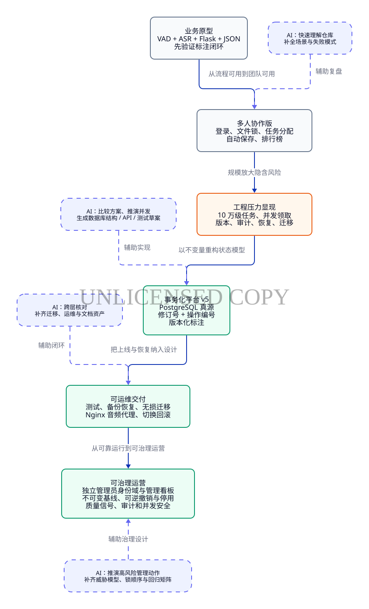

*图 1：项目不是一次性“生成”出来的，而是在业务反馈与工程约束中，从原型、事务化、可运维继续演进到可治理运营。[D2 源文件](diagrams/01_project_evolution.d2)*

## 1. 项目要解决的真实问题

项目服务于埃及方言音频语料生产。输入是一批原始音频，输出不是简单的文本文件，而是一组可以追溯到音频、片段、标注员和版本的训练数据。

一条音频大致经过以下过程：

1. 使用 Silero VAD 检测语音区间并自动断句。
2. 使用 Qwen3.5-Omni 生成阿拉伯语预转写，作为人工参考。
3. 标注员逐段听音频，确认或重写文本，调整起止时间，标记不可训练片段。
4. 对整条不可用音频，可选择噪声（`Noisy`）、非埃及方言（`Not Egyptian`）、音质差（`Poor quality`）等原因跳过。
5. 正式提交后形成已发布版本，之后仍可通过纠正流程产生新版本。
6. 当前有效版本可以导出为 Excel 或兼容 JSON，用于统计、审计和后续训练。
7. 管理员通过独立控制台观察语料、质量信号和任务池，并以可审计事务撤销、恢复或回收异常状态。

这里存在两种容易混淆的“AI”：

| 类型 | 在项目中的作用 | 必须保留的人类控制 |
|---|---|---|
| 产品内 AI | VAD 断句、ASR 预转写、文本分类，降低重复劳动 | 预转写只是提示，必须由标注员听音频确认；人工结果优先级最高 |
| 研发协作 AI | 阅读仓库、推演方案、生成代码与测试草案、核对文档和部署流程 | 人定义业务语义、数据安全边界、验收标准和上线时机 |

这一区分非常重要。产品内 AI 可能识别错误，研发协作 AI 也可能给出“看起来合理”但不符合业务的实现。两者都不能被当作真相源。

### 1.1 功能需求背后的工程需求

| 用户看到的功能 | 背后的软件工程问题 |
|---|---|
| 点击“领取下一条任务” | 多进程、多用户并发下的原子领取与唯一性 |
| 3 秒自动保存 | 请求串行化、并发版本控制、响应丢失后的安全重试 |
| 退出后再次登录继续工作 | 登录会话与任务持有关系必须解耦 |
| 查看历史已完成任务 | 历史浏览不能暗中改变当前任务持有关系 |
| 纠正已完成记录 | 草稿与已发布版本隔离，发布时再原子替换 |
| 播放大音频 | 先鉴权，再由 Nginx 处理 Range 和 sendfile，避免占满应用线程 |
| 查看全局管理看板 | 当前有效语料与历史活动必须使用不同统计口径，时间筛选必须有明确时区 |
| 撤销错误标注 | 不删除历史；校验当前版本，从不可变基线重建干净任务，并完整审计 |
| 停用标注员 | 会话、任务持有关系、保留任务和当前有效成果必须在一个事务中协调处理 |
| JSON 升级到 PostgreSQL | 冻结、盘点、校验、迁移、回导、恢复和回滚必须形成闭环 |

这也是本项目最重要的认识之一：**很多“前端功能”其实是状态一致性问题，很多“数据库改造”其实是业务语义问题。**

## 2. 从快速原型到事务化平台

早期版本采用 Flask + JSON 文件。任务分配、活跃用户和标注结果保存在文件中，并通过 `fcntl` 文件锁和原子替换降低并发写坏文件的风险。这个方案并不“落后”，它非常适合验证第一版业务闭环：开发快、部署简单、数据肉眼可读，也让团队尽早确认 VAD、ASR、波形和标注交互是否真正有用。

但当目标扩大到 10 万级任务和多人并发后，原型阶段的优势开始变成约束：

- 每次扫描大量 JSON 文件的成本不断增加；
- 文件锁很难自然表达“一人最多一个任务、一条任务最多一个人”的复合不变量；
- 自动保存、完成状态、任务释放和历史记录无法轻易放进同一个事务；
- 修改已完成结果时，覆盖文件会抹掉版本边界；
- 丢失网络响应后，客户端不知道上一次写入到底有没有成功；
- 旧数据迁移缺少逐条、可证明的一致性验证。

此时最危险的做法，是只把 JSON 换成数据库表，而不重新定义业务状态。真正需要重构的是“状态模型”和“事务边界”。

在 AI 协作中，我发现先让 AI 写代码通常不是最高效的起点。更有效的任务描述类似下面这样：

> 在不覆盖人工标注、不丢失任务归属、能够回滚的前提下，把 JSON 真源迁移到 PostgreSQL。先列出业务不变量、失败场景和验收证据，再设计数据库结构、事务和 API；不要先改代码。

这样做以后，AI 输出的不再只是一个数据库连接示例，而会自然扩展到并发领取、版本、幂等、审计、迁移清单和恢复验证。最终选用哪些方案仍由人决定，但方案空间被更快地展开了。

事务化平台解决了“多人如何可靠地生产数据”，却没有自动解决“语料如何被持续治理”。当错误成果需要撤销、标注员需要停用、管理者需要解释历史产出时，如果只在数据库里执行几条临时 SQL，就会重新失去版本、权限和审计边界。最新提交因此把管理员能力作为一个新的纵向切片实现：从独立身份、管理看板和质量信号，一直做到不可变基线、原子撤销与恢复、软停用、应用级审计与并发回归测试。

这一阶段使用 AI 时，我给出的核心问题也发生了变化：不再只是“怎样完成操作”，而是“怎样让高风险操作可预览、可冲突、可重试、可审计、必要时可恢复”。这使管理员页面从一个统计页面，演进成了真正的治理控制面。

## 3. 总体架构：让每一层只承担自己的职责

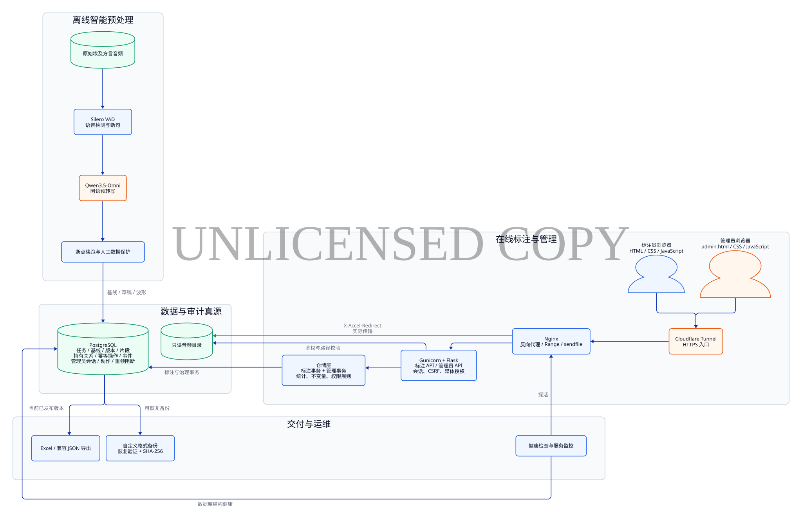

*图 2：标注员与管理员共享同一条 HTTPS、Nginx、Flask 和 PostgreSQL 交付链路，但在身份、会话、CSRF 和权限规则上彼此隔离。[D2 源文件](diagrams/02_system_architecture.d2)*

系统保留了简单、直接的技术栈，但重新划清了职责边界：

- **标注员浏览器端**负责音频交互、片段编辑、本地未保存状态、保存队列和冲突提示。
- **管理员浏览器端**由独立的 `admin.html / admin.css / admin.js` 组成，提供总览、标注员、语料、质量和活动日志，并保持响应式布局、键盘操作和对话框焦点管理。
- **Flask API**负责身份校验、输入解析、HTTP 语义和媒体访问授权。普通标注 API 与 `/api/admin/*` 使用不同的会话、装饰器和 CSRF 策略。
- **仓储层**集中承载任务领取、保存、完成、纠正，以及管理员统计、撤销、恢复、停用和任务回收。数据库事务不散落在路由函数里。
- **PostgreSQL**是唯一在线真源，除任务、版本、片段、波形、任务持有记录和幂等操作外，还保存不可变基线、管理员会话摘要、管理员动作、逐项结果和重领阻断关系。
- **Nginx**处理音频 Range、sendfile 和 `X-Accel-Redirect`，同时为管理员登录提供独立限流。Flask 只判断“这个人能不能访问这条音频”，不亲自长时间传输大文件。
- **Cloudflare Tunnel**提供公网 HTTPS 入口，Gunicorn 与 PostgreSQL 只监听本机服务链路。
- **离线管线**完成 VAD、ASR、分类和预处理入库，并遵守“不覆盖人工或已发布数据”的保护规则。
- **运维资产**包括迁移执行器、备份恢复、健康检查、监控、切换与回滚脚本。

管理员功能规划阶段曾认真比较过 React + TypeScript 与原生模块化前端。最终实现没有照搬最初的 React 建议，而是为了保持现有零构建部署，选择隔离的原生 `admin.html / admin.css / admin.js`；同时避免把所有样式和逻辑重新塞进一个超大内联 HTML。这个取舍很能体现人机协作的正确关系：AI 可以展开候选技术栈，人要根据运维成本、团队规模和现有系统做决定。**是否增加技术栈，应由问题复杂度决定，而不是由 AI 的默认偏好决定。**

## 4. 领域模型：先把不变量写进系统

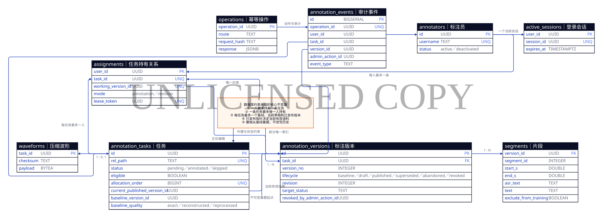

*图 3：任务、不可变基线、版本、持有关系、幂等操作与管理员审计共同构成系统状态。[D2 源文件](diagrams/03_domain_model.d2)*

数据模型中的关键对象如下：

- `annotators` 表示标注员身份，记录启用（`active`）或停用（`deactivated`）状态，并在停用时保留原因；停用不会抹掉这个人曾经完成的工作。
- `annotation_tasks` 表示稳定的音频任务身份，同时保存当前已发布版本指针、不可变基线指针和基线质量来源。
- `annotation_versions` 表示一次机器基线、可编辑草稿或正式成果，生命周期包括基线（`baseline`）、草稿（`draft`）、已发布（`published`）、已被新版本替代（`superseded`）、已放弃（`abandoned`）和已撤销（`revoked`）。
- `segments` 隶属于某个版本，因此修改纠正草稿不会提前影响线上有效结果。
- `assignments` 表示“谁正在编辑什么”，包含模式、工作版本和不可猜测的租约令牌 `lease_token`。
- `active_sessions` 只表示登录是否有效，不决定任务是否释放。
- `operations` 保存幂等操作结果，解决“请求已经成功，但响应丢了”的问题。
- `admin_sessions` 只保存管理员令牌与 CSRF 令牌的摘要，并同时受空闲期限和绝对期限约束。
- `admin_actions / admin_action_items` 记录一次管理动作及其逐任务结果；`task_annotator_blocks` 防止被撤销成果的原提交者立即重新领回同一任务。
- `annotation_events` 记录领取、完成、放弃、纠正和管理员操作，并可关联到对应的管理动作。

最关键的工程决策不是表名，而是这些不变量：

1. 一个标注员最多持有一条任务，一条任务最多被一个标注员持有。
2. 查看任务持有记录不会隐式领取；领取必须是显式动作。
3. 退出登录、会话超时、刷新和服务重启都不会释放未完成任务。
4. 每个任务最多存在一个当前草稿和一个当前已发布版本。
5. 每个任务恰好有一个不可变基线；重置任务时只能从它生成新的干净草稿，不能拿人工版本反推机器真源。
6. 导出只认 `current_published_version_id` 指向的当前有效成果；被撤销的版本保留证据，但不再进入当前语料。
7. 完成或跳过时，最后修改、状态、版本发布、审计事件和任务持有关系释放必须在同一个事务中提交。
8. 批量撤销、恢复和停用也必须全有或全无，并以预期版本或前置状态拒绝过期操作；重试使用 `operation_id` 保持幂等。
9. 预处理只能在确认尚未分配、发布或人工修改时刷新精确基线，不能覆盖已进入人工流程的数据。
10. 标注员停用采用软删除：立即失去会话和工作权，但身份、版本与审计历史必须保留。

我以前更习惯把这些规则写在业务代码的 `if` 里。这个项目让我更深地体会到：**真正重要的不变量要尽量同时落在数据库唯一约束、外键、部分索引和事务中。** 应用代码可能被新入口绕过，数据库约束则是最后一道防线。

AI 在这一阶段最适合扮演“反例生成器”。我会让它主动回答：两个用户同时领取会怎样？同一个用户双击领取会怎样？旧标签页晚到的保存会怎样？完成请求重试会怎样？纠正中途放弃会不会污染旧版本？这些问题比“帮我写一个 `claim` 领取函数”更有价值。

### 4.1 任务与版本的生命周期

新音频预处理后产生待领取（`pending`）任务、一份不可变机器基线和一份独立的可编辑草稿。标注员显式领取后，任务持有记录把用户、任务、工作版本和租约绑定起来。保存只修改工作草稿；正式完成或跳过时，草稿才发布为当前版本，并释放任务持有关系。

需要纠正已完成数据时，系统复制当前已发布版本，生成新的纠正草稿。纠正过程中的自动保存不会改动旧版本；再次提交后，新版本成为已发布版本，旧版本转为已被替代状态。若放弃纠正，纠正草稿进入已放弃状态，旧版本保持不变。

如果管理员撤销当前已发布版本，系统不会删除它，而是把它标记为已撤销（`revoked`），清空任务的当前已发布版本指针，再从基线复制一份不含人工文本、默认不排除训练的干净草稿，使任务重新回到待领取状态。原提交者会被阻止再次领取该任务。只有在任务仍未领取、干净草稿未变化、撤销后没有发生新领取，且原提交者仍处于启用状态时，系统才允许恢复原版本。

这一设计牺牲了一点存储空间，却换来了清晰的审计、可恢复性和“草稿不污染正式数据”的安全感。对于人工语料，这种交换非常值得。

### 4.2 为什么需要不可变基线

在没有基线时，“把错误标注退回待处理”看似只要把任务状态改成待领取，实际上马上会遇到一个无法可靠回答的问题：新的草稿从哪里来？如果复制当前人工版本，错误会被带回；如果重新运行模型，模型版本和参数变化又会让结果不可复现；如果把人工字段手工清空，也可能保留了人工调整过的边界和排除标记。

因此最新迁移为每条任务建立独立基线，并将质量记录为精确保留（`exact`）、保守重建（`reconstructed`）或重新处理（`reprocessed`）：新任务直接保留当次机器预处理的精确结果；旧的、从未被人工接触的草稿可以标记为精确保留；已进入人工流程的历史任务只能保守重建，并明确清除人工文本和训练排除标记。质量标签不是装饰，而是在告诉后续管理员“这份恢复起点有多可信”。

这项设计也是一次典型的 AI 辅助推演：AI 很快指出了删除、覆盖和重新推理各自的失败路径，人最终选择了“不可变真源 + 显式质量 + 可追溯重建”的语义。关键不是 AI 提出了基线这个概念，而是我们把它落实为唯一索引、版本生命周期、迁移回填、预处理保护规则和自动化测试。

## 5. 关键实现：并发领取与可靠自动保存

### 5.1 原子领取

任务领取使用 `SELECT ... FOR UPDATE SKIP LOCKED`：事务只锁定自己准备领取的候选行，其他标注员可以跳过已锁行继续领取。`assignments.user_id` 与 `assignments.task_id` 的唯一性分别保证“一人一条”和“一条一人”；同一个用户的并发领取还会通过数据库锁串行化。

任务按稳定的 `allocation_order` 分配，而不是对 10 万行执行随机排序。系统还区分了“确实没有可领取任务”和“候选任务正在被另一个事务短暂锁定”，让前端可以给出准确提示，而不是把所有 409 都显示成“任务做完了”。

### 5.2 保存不是一次普通的 PATCH

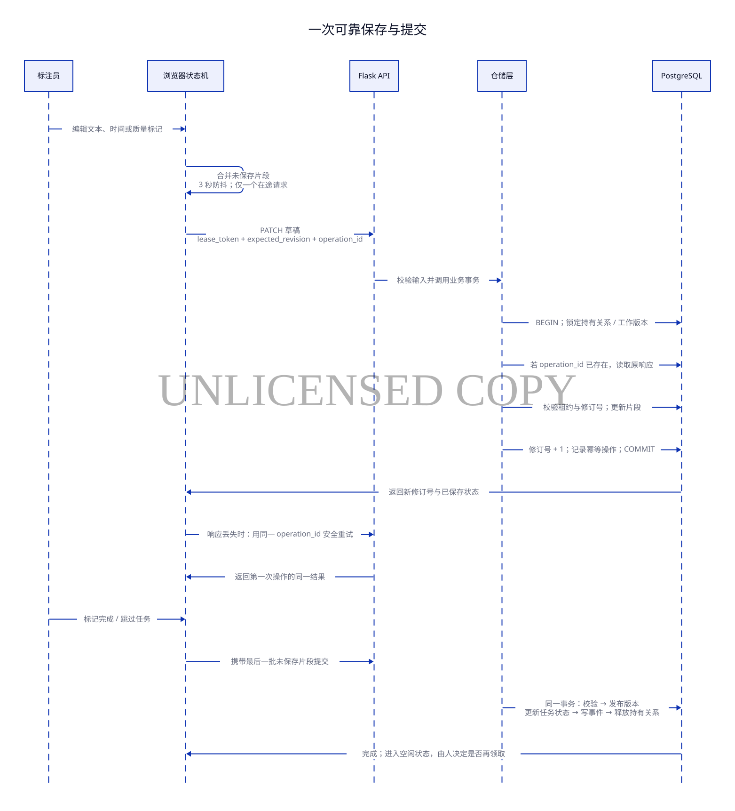

*图 4：可靠保存依赖浏览器串行化、租约、乐观并发、幂等操作与数据库事务共同完成。[D2 源文件](diagrams/04_reliable_save_sequence.d2)*

自动保存包含三层防护：

- 浏览器把多个未保存片段合并，停止编辑约 3 秒后发送；同一任务只允许一个保存请求在途。
- `expected_revision` 实现乐观并发控制。旧标签页不能覆盖服务器上的更新版本，冲突后页面会停止继续写入并提示重新加载。
- `operation_id` 实现幂等重试。第一次写入成功但响应丢失时，客户端用同一操作编号重试，服务器返回第一次操作的同一结果，而不是再写一遍。

`lease_token` 则证明当前页面仍持有这条任务。修订号解决“内容是否过时”，租约解决“你是否还有权写”，操作编号解决“同一个动作是否已经执行”。三个概念职责不同，缺一不可。

完成和跳过请求还会携带最后一批未保存修改。服务端在同一事务里完成片段校验、发布版本、更新任务状态、写审计事件和释放任务持有关系，因此不会出现“页面显示已完成，但最后一句话没有保存”的中间状态。

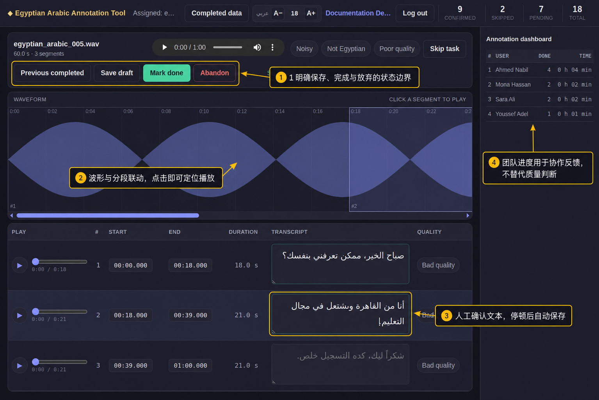

*图 5：工作台把任务控制、波形定位、人工文本确认和团队进度放在同一视图。黄色框线与中文说明为本文添加，不属于产品界面；截图使用隔离的演示数据。[查看原始截图](images/01_annotation_workspace_raw.jpg)*

这张界面的重点不在按钮数量，而在于把状态边界呈现给人：保存草稿、正式完成、跳过和放弃是不同动作；机器预转写以占位提示出现，只有人工输入才算确认；团队进度提供协作反馈，却不能替代质量复核。后端的不变量只有在界面中被正确表达，用户才不容易做出与系统语义相反的操作。

这类问题非常适合让 AI 辅助枚举边界条件：双击按钮、网络超时、响应丢失、两个标签页、并发登录、服务重启、完成前最后一次输入。AI 能迅速列出测试草案，但人要继续追问：哪个结果才符合标注业务？例如本项目明确选择“退出登录不释放任务”，因为登录状态和工作所有权不是一回事。

## 6. 产品内 AI：让机器先做重复劳动，让人确认语义

预处理管线先运行 VAD，再对语音片段并发调用 ASR。为了适应大批量语料和外部服务限流，当前实现支持：

- 已处理任务跳过，允许中断后继续；
- ASR 片段级断点和有限重试；
- 限流时退避，并可降低并发恢复；
- 无语音或内容审核拒绝默认保留源音频，记录为不可领取，而不是静默删除；
- 预处理批量查询已有状态，避免 10 万文件逐条访问数据库；
- 已分配、人工修改或已发布数据始终受到保护。

ASR 文本在界面中只是灰色参考，不算人工确认。标注员必须听音频后输入或确认文本。这一交互细节体现了项目对 AI 的基本态度：**机器建议可以提高起点，但不能偷换责任主体。**

现在，预处理结果还会同时进入两条用途不同的路径：一份写成不可变基线，作为未来安全重置的机器起点；另一份写成独立草稿，供标注员修改。二者初始内容相同，却不能共享可变身份。这个看似冗余的复制，正是为了保证人工编辑永远不会反向污染机器基线。

研发协作 AI 也应遵守同样原则。AI 生成的代码可以作为高质量草稿，但只有经过代码差异审查、自动化测试、迁移验证和真实场景验收后，才有资格进入交付链路。

## 7. 管理控制面：让高风险操作可观察、可逆、可审计

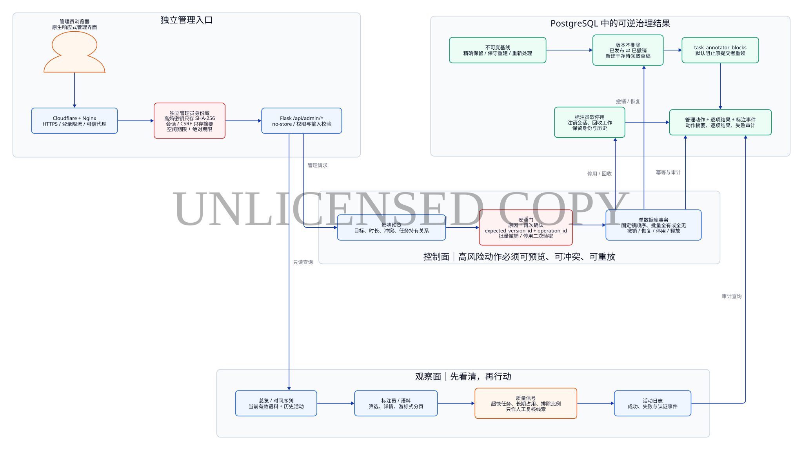

*图 6：管理员功能不是绕过业务规则的“超级入口”，而是一条独立身份、先观察后操作、以基线重建、全程留痕的治理链路。[D2 源文件](diagrams/07_admin_control_plane.d2)*

最新提交的主题是“新增安全管理员看板与任务控制能力”。如果只从文件数量看，它新增了一个 `admin.html` 页面；如果从软件工程视角看，它实际补上的是平台的治理闭环：管理者先看见当前有效语料与历史活动，再通过受保护的事务改变状态，并且能解释谁在什么时候、基于哪个版本、以什么理由做了什么。

### 7.1 独立身份域不是换一张登录页

管理员功能没有复用标注员的 Flask 会话，也没有把“知道管理员页面地址”当成权限。高熵管理员密钥的明文保存在仓库之外，服务端环境只配置它的 SHA-256；登录成功后，数据库仅保存随机会话令牌和 CSRF 令牌的摘要，而不是可直接使用的凭证。管理员会话同时具有空闲期限和绝对期限，生产环境的 Cookie 使用 Secure、HttpOnly、SameSite 与 `__Host-` 约束。

所有写操作都要求独立 CSRF 证明，敏感响应使用 `Cache-Control: no-store`。登录入口既有 Nginx 限流，也有应用内回退限制，并按受信代理规则解析来源地址。批量撤销和标注员停用还需要再次输入管理员密钥；这是二次认证，用来降低已经打开的管理会话被借用时的破坏范围。失败的认证和管理写入同样进入审计，密钥与令牌则必须在记录前脱敏。

这些措施最初很容易被概括成一句“做个管理员登录”。AI 辅助威胁建模让问题迅速扩展到 Cookie 窃取、CSRF、暴力尝试、反向代理伪造、数据库泄漏和会话长期占用。人的工作是结合真实部署拓扑决定边界：哪些凭证绝不能落库，哪些动作需要二次确认，哪些代理头才可以信任。

### 7.2 管理看板先区分“发生过”与“现在有效”

控制台提供总览与时间序列、标注员、语料与任务、质量、活动日志五类视图，支持日期与时区、标注员、状态、目录、类别和关键词筛选；大结果集使用游标式分页，当前筛选结果可由浏览器端导出 CSV。

这里最重要的不是图表数量，而是统计口径。系统同时提供“当前有效语料”和“历史活动”两类指标：被撤销的版本不应继续贡献当前训练语料，但撤销之前真实发生过的提交不能从历史工作量中消失。质量页中的异常快速完成、长期持有、排除片段比例和撤销次数也只是复核线索，不是对人的自动评分。当前周转时长仍按领取到提交的墙钟时间计算，其中包含停顿和离开页面；文档明确说明这一局限，精确的有效工作计时留待后续实现。

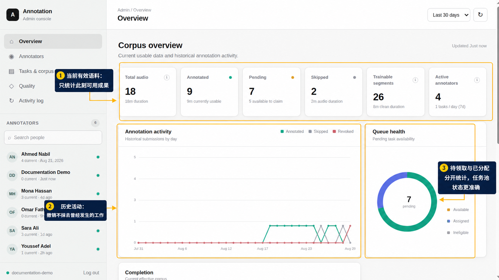

*图 7：总览同时呈现当前有效语料、历史活动和任务池健康度，避免用一套数字回答三个不同问题。黄色标注为本文说明；截图使用隔离的演示数据。[查看原始截图](images/02_admin_overview_raw.jpg)*

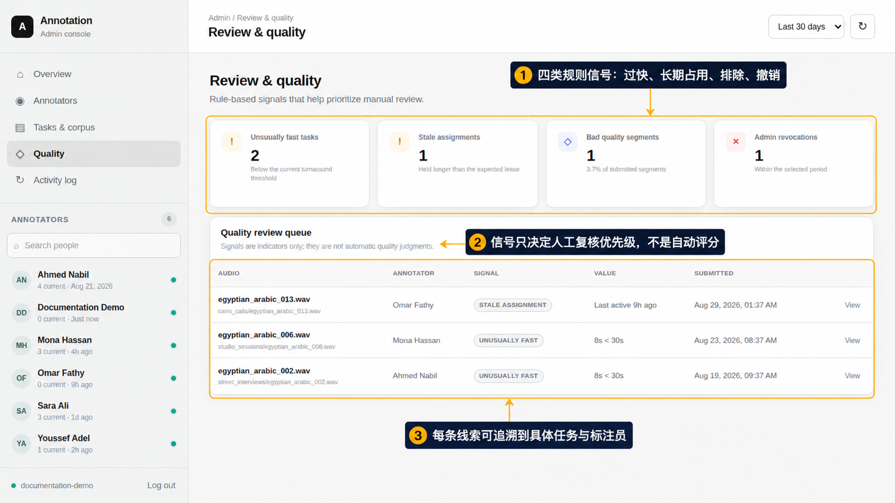

*图 8：质量页把规则信号组织成人工复核队列，并明确声明“信号不是自动质量判断”。每条线索都能追溯到具体任务和标注员。黄色标注为本文说明；截图使用隔离的演示数据。[查看原始截图](images/03_admin_quality_raw.jpg)*

这提醒我，管理看板的可信度取决于定义，而不是视觉精美程度。让 AI 生成聚合 SQL 很快，但“当前”“历史”“活跃”“质量”这些词必须先由人写成可检查的业务语义。

### 7.3 撤销不是删除，恢复也不是后悔按钮

撤销先经过只读预览，报告将受影响的任务和冲突；执行时携带 `expected_version_id` 拒绝过期页面，并用 `operation_id` 支持安全重试。批量上限为 100 条，任务编号排序后按固定顺序加锁，整批在一个数据库事务中全有或全无。

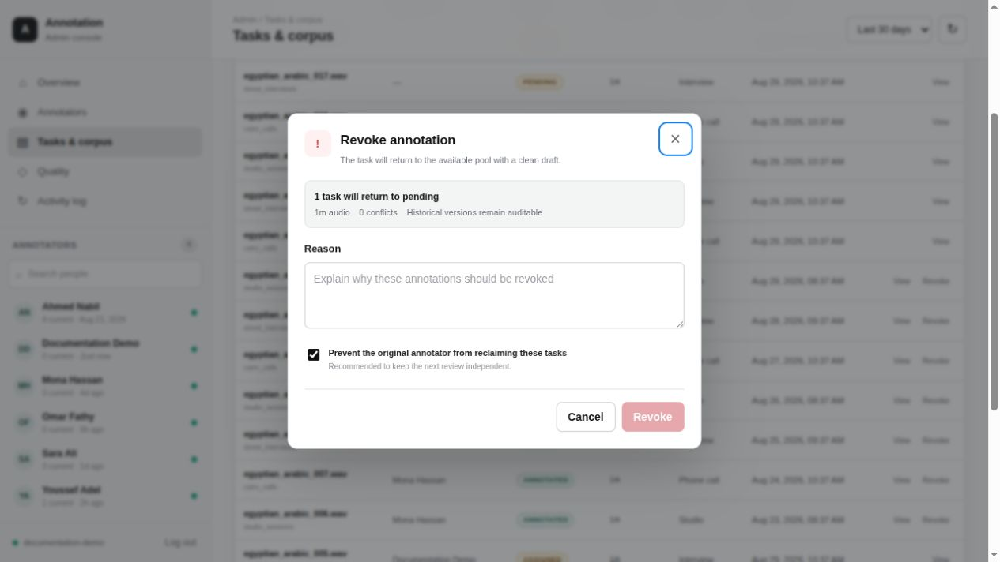

*图 9：浏览器原始截图。撤销窗口先展示影响范围与冲突，要求填写原因，并默认阻止原提交者立即重领；版本仍保留审计证据。截图使用隔离的演示数据。*

成功撤销后，当前已发布版本被标记为已撤销，而不是删除；任务清空当前版本指针并回到待领取状态；系统从不可变基线生成不含人工文本、默认不排除训练的干净草稿；原提交者被阻止再次领取同一任务；管理动作、逐项记录和标注事件同时落库。单条撤销仍需有效管理员会话与 CSRF，批量撤销则额外要求二次输入密钥。

恢复比撤销更保守。它只接受某次撤销动作作为来源，并要求原提交者仍处于启用状态、任务仍待领取且无人持有、撤销后没有发生新领取、干净草稿也未被修改。全部前置条件成立后，系统才重新发布原先被撤销的版本、放弃干净草稿、移除重领阻断并写入审计。恢复不是“把状态字段改回来”，而是证明撤销之后没有出现新的事实。

### 7.4 停用不是删人

标注员停用同样先预览影响范围，执行时既要二次输入管理员密钥，也要再次确认用户名。在同一个事务中，系统删除该用户的活动会话，释放任务持有关系和预留状态，撤销仍由该用户贡献且当前生效的已发布版本，从基线重建干净草稿，最后把账号标为停用。

这里选择软停用，是因为身份已经成为数据出处的一部分。删除标注员会破坏历史解释力；只禁止登录又会留下被占用任务和仍在生效的异常成果。最新实现把“人的访问权”“进行中的工作”“当前语料”和“历史证据”分开处理，再用事务把它们协调起来。

### 7.5 AI 在治理功能中的角色

这次我没有只让 AI 列接口，而是要求它推演撤销与纠正提交竞争、恢复与停用竞争、释放与完成竞争、批量操作中途失败、重试重复执行，以及审计日志泄漏密钥等反例。AI 擅长快速形成状态矩阵和测试草案，但诸如“撤销后谁能重领”“历史产出是否继续计数”“恢复需要满足什么条件”仍是产品与治理判断，必须由人确认。

这也是最新提交最重要的收获：对高风险功能，AI 辅助研发的产出不应只是更多代码，而应是一组彼此吻合的威胁模型、领域语义、事务边界、界面提示、部署约束和回归证据。

## 8. 数据迁移与上线：迁移不是脚本，是一个工程功能

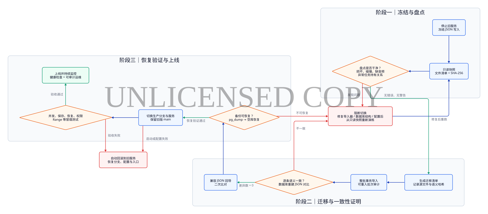

*图 10：任何盘点、语义校验、恢复验证或冒烟测试失败，都会阻断切换或触发回滚。[D2 源文件](diagrams/05_migration_cutover.d2)*

从 JSON 切换到 PostgreSQL 时，最重要的目标不是“把数据插进去”，而是证明迁移前后的业务语义一致。完整流程包括：

1. 停止旧服务，冻结源 JSON，制作只读快照和 SHA-256 清单。
2. 盘点损坏 JSON、同名不同扩展名、旧键冲突、缺失音频、非法片段和异常任务持有关系。
3. 生成迁移清单，记录每个源文件的精确哈希和规范化语义哈希。
4. 以整批事务导入，并记录可重入的导入批次和逐项审计。
5. 从 PostgreSQL 重建规范 JSON，与迁移清单逐条比较；任何不一致都阻断切换。
6. 再回导兼容 JSON，验证往返一致性，而不是只比较数据库行数。
7. 生成 PostgreSQL 自定义格式备份，并在空库或隔离临时实例中真实恢复。
8. 保留旧 `main` 作为回滚指针，切换生产分支、服务、Nginx 与隧道。
9. 执行并发领取、保存、恢复、权限、纠正和音频 Range 等冒烟测试。

在这次 JSON 大迁移之后，最新提交又增加了第二类迁移：在线数据模型的版本化演进。`002_admin.sql` 不只创建管理员相关表，还要为已经存在的每条任务补齐基线。迁移会识别仍是原始机器草稿的任务，将其标记为精确保留；对已经发布、分配或被人工触碰的历史数据，只能保守重建基线，并清除可能属于人的文本和训练排除标记。唯一索引保证每条任务只有一份基线，迁移测试则验证表结构、约束和回填结果。

这让我进一步意识到，无损迁移不仅是“不少一行数据”。当新模型要求过去并不存在的事实时，系统不能伪造确定性；它应保存来源与质量，明确区分“精确保留”“保守重建”和“重新处理”。AI 能帮助编写回填 SQL 和样例矩阵，但是否有资格把一条历史记录标记为 `exact`，必须由人根据证据判定。

AI 在这里帮助我补齐了大量“平时容易觉得以后再做”的资产：盘点器、迁移清单、往返一致性校验、恢复演练、切换前置条件、自动回滚分支以及故障排查文档。但生产切换不能交给 AI 自主决定。什么时候冻结数据、是否接受某个警告、备份位置是否真的异盘、失败后是否回滚，必须由掌握现场情况的人授权。

这次实践让我认识到：**迁移的完成标志不是新服务启动，而是旧数据可证明地被保留、新系统可恢复、失败路径也被演练。**

## 9. 测试：把“我觉得没问题”变成可重复的证据

仓库当前定义了 66 个自动化测试场景。最新提交没有把管理员能力当成一个只做页面截图的前端功能，而是把 31 个新增场景分布到 API、迁移和仓储事务层：

| 测试组 | 数量 | 主要验证内容 |
|---|---:|---|
| 标注仓储层 | 17 | 并发领取唯一性、幂等、修订冲突、完成与跳过、纠正、释放与登录竞态 |
| 标注 API | 10 | 会话、显式领取、退出后恢复、历史权限、输入校验、媒体授权与 Range |
| JSON 迁移 | 8 | 损坏文件与键冲突阻断、源文件变更、整批回滚、波形兼容与往返一致性 |
| 管理员功能 | 31 | 独立认证与 CSRF、游标和时区、基线回填、原子撤销与恢复、停用、幂等及并发竞争 |

此外还有 10 万任务负载脚本、仓储层冒烟脚本、生产切换冒烟清单、备份恢复验证和命令脚本语法检查。测试在这里不只是防回归，也参与设计：如果一条业务规则无法被写成稳定测试，往往说明规则本身还不够清楚。

### 9.1 把一次真实红灯变成长期回归资产

初版复盘曾诚实记录过一次“34 项通过、1 项失败”（原始输出：`34 passed, 1 failed`）：音频 Range 测试保留了生产用 `AUDIO_ACCEL_PREFIX`，Flask 测试客户端因而只得到 `X-Accel-Redirect` 响应，却没有真实 Nginx 填充响应体。它暴露的不是 Range 业务逻辑错误，而是测试环境与生产媒体代理之间缺少明确边界。

最新提交把这个环境契约写进实现：配置了媒体代理且不处于 Flask 测试模式时，继续使用生产 `X-Accel-Redirect`；测试环境则直接使用 `send_file`，管理员音频授权路径也遵守同一边界。原来的红灯由此变成了一条长期回归资产，而不是被删除或绕过的“不稳定测试”。

在本文更新时，我用临时 PostgreSQL 重新运行了完整测试集，结果为 **66 项全部通过，用时 43.35 秒**（原始输出：`66 passed in 43.35s`）。这件小事很能说明 AI 辅助研发的正确姿势：AI 可以生成看起来完整的总结，但人不能让“叙述完整”替代运行证据；一次诚实记录的失败，经过原因定位、边界澄清、修复和复验，才真正成为工程收获。

## 10. 我实际采用的人机协作闭环

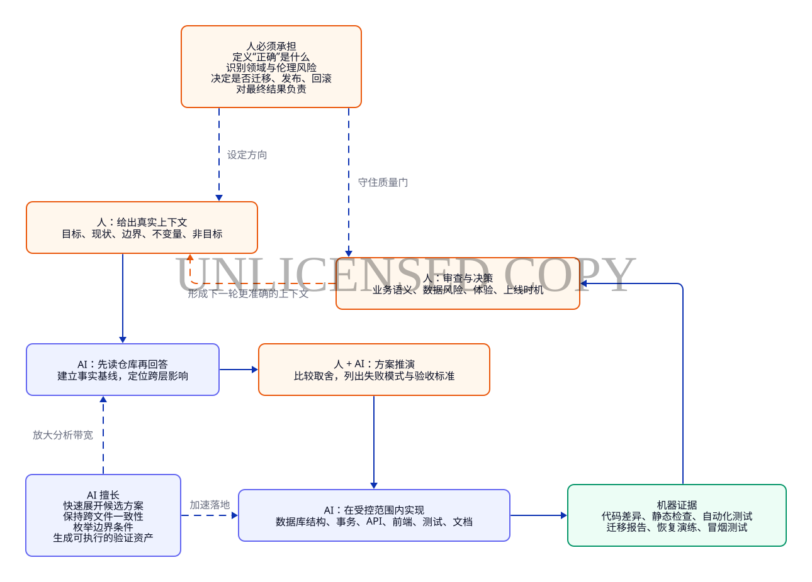

*图 11：AI 放大分析与实现带宽，人负责方向、质量门和最终结果。[D2 源文件](diagrams/06_human_ai_loop.d2)*

### 10.1 先给上下文，再给任务

AI 的输出质量高度依赖上下文。只说“把存储改成 PostgreSQL”，它很可能给出局部正确、系统错误的代码。更有效的输入包含六部分：

```text
背景事实 + 当前实现 + 目标行为 + 必须保持的不变量 + 明确非目标 + 可执行验收证据
```

例如设计任务领取时，我需要明确说明：多人并发；一人最多一条；读取不等于领取；退出登录不释放；迁移遗留草稿优先回到原用户；没有任务和暂时锁忙要给出不同结果。上下文越准确，AI 越有机会成为工程协作者，而不是代码补全器。

### 10.2 让 AI 先调查，再提出改动

先阅读 README、数据库结构、路由、仓储层、前端状态机、测试和部署脚本，再设计方案。这样可以减少重复实现，也能发现一个改动的跨层影响。例如“完成后不自动领取下一条”同时涉及仓储层返回值、API、页面空闲状态、操作手册和测试，不能只改一个按钮。

管理员功能开发再次验证了这一点：最初方案倾向 React，但调查现有零构建部署、页面规模和维护成本后，最终采用隔离的原生模块。AI 给出的第一方案不是承诺，仓库事实和工程约束才是决策输入。

### 10.3 把大目标切成可验证的纵向切片

我会把任务拆成“数据库结构与不变量 → 仓储事务 → API 契约 → 前端状态 → 测试 → 迁移与运维文档”。每一片都要产生可检查的代码差异和验证结果。AI 适合在这些边界清楚的切片内快速实现，也适合跨文件核对命名、状态和错误语义是否一致。

最新管理员能力就是一个完整纵向切片：`002_admin.sql` 先建立基线、身份和审计基础，仓储层定义可逆事务，API 加入认证、CSRF 和冲突契约，页面呈现预览与结果，部署配置补齐 Cookie、代理和限流，最后由 31 个管理员功能测试锁定行为。按页面、后端或数据库横向“各做一点”，很难获得同样完整的闭环。

### 10.4 要求 AI 主动找反例

比“请检查代码”更有效的问题是：

- 两个事务同时执行时，哪一行先被锁？
- 如果数据库已提交但 HTTP 响应丢失，会重复产生什么？
- 如果旧页面晚到 30 秒，还能不能覆盖新页面？
- 如果迁移后回导 JSON，未知字段和波形是否仍能保持往返一致？
- 如果备份文件生成成功但无法恢复，这算不算成功备份？
- 如果管理员撤销的同时标注员正在提交纠正版本，谁应当成功？
- 如果恢复与停用同时发生，怎样保证不会复活已失效的身份或成果？
- 如果审计失败请求，怎样既保留调查证据又不记录密钥、令牌和 CSRF 密钥？

AI 的优势是能快速枚举这些反例；人的职责是判断哪些反例真实、哪些结果符合业务，并把高风险场景转成测试和门禁。

### 10.5 保留人的否决权

以下边界不能因为 AI 给出的实现“很顺”就放松：

- 不用自动过期替代明确的任务所有权规则；
- 不为方便重跑而覆盖人工标注或已发布版本；
- 不用物理删除简化撤销和停用，不让高风险管理入口绕过领域事务；
- 不为了通过迁移而跳过不一致项；
- 不把凭证、令牌或 CSRF 密钥写进数据库明文和审计日志；
- 不把“备份命令退出 0”当成“备份可恢复”；
- 不把规划文档写成已经实现的功能；
- 不在未审查代码差异、未运行验证时声称完成。

## 11. 心得、收获与变化

### 11.1 AI 提高的首先是思考带宽

过去，一个需求涉及数据库、API、前端、测试、部署和文档时，我容易先完成最显眼的代码，把迁移、故障恢复和说明留到最后。AI 能快速铺开这些关联，让我在设计初期就看到全链路。节省下来的不只是打字时间，更是反复切换上下文的成本。

### 11.2 人的责任没有减少，反而更集中

AI 写得越快，错误扩散也可能越快。我的角色从“逐行生产所有代码”转向“设计约束、选择方案、审查差异、组织证据和承担结果”。这不是减少责任，而是把责任集中到更高杠杆的位置。

### 11.3 最值得信任的不是 AI，也不是人的直觉，而是证据链

一次测试通过不能证明迁移无损，一份数据库备份不能证明可以恢复，一个 API 返回 200 不能证明并发安全。可靠性来自彼此补充的证据：数据库约束、事务、幂等记录、自动化测试、语义哈希、往返一致性校验、恢复演练、冒烟测试和可回滚方案。

### 11.4 文档本身也是工程成果

AI 很擅长把分散在代码中的知识整理成 README、操作手册、部署指南和故障排查，但前提是人先核对“已实现”和“计划中”的边界。清晰文档降低了系统对某一个开发者记忆的依赖，也让后续 AI 能在更准确的上下文中继续协作。

本文的界面配图也遵循同样原则：浏览器先对隔离演示环境取得原始截图，AI 再帮助加入讲解框线，人负责选择真正值得强调的视角、核对标注含义，并在文档中保留原图链接。AI 可以帮助读者更快地看懂界面，但不能用经过讲解加工的图片替代原始证据。

### 11.5 项目的三层收获

- **产品层**：得到了一套从智能预处理、人工标注、版本纠正、治理控制到导出的完整平台，管理者既能看见语料，也能安全处理异常状态。
- **工程层**：建立了并发不变量、不可变基线、可逆管理事务、独立高权限身份、幂等审计、无损迁移、可恢复备份和可回滚发布的系统思维。
- **个人层**：学会把 AI 当作能够调查、推演、实现和复核的协作者，同时坚持由人定义正确、把关风险并对上线负责。

## 12. 当前边界与下一步

这份复盘只描述当前已落地能力，不把规划当成果。仓库中的管理员看板文档已经标记为“最小可用版本已实现”，同时明确保留了下一阶段边界：

- 审核员工作流、质量抽检、接受、退回、修正后接受等判定与一致性指标；
- 活跃标注计时，区分真实工作时间和领取到提交的墙钟时间；
- 当前应用级审计已经落地，数据库角色隔离与防篡改审计存储仍属于生产加固项；
- 将现有 66 项测试、迁移检查和静态校验纳入持续集成门禁；
- 在接近生产的配置下继续做 10 万任务负载和连接池观测；
- 确保备份真正落到异盘、异机或对象存储，而不只是同一块 NVMe；
- 增加慢查询、池等待、任务池健康和 ASR 限流等可观测指标。

这些任务同样可以继续使用 AI 辅助，但方法不应改变：先定义风险与不变量，再设计、实现、验证，最后由人决定是否交付。

## 13. 结语

这个项目让我对 AI 辅助研发有了一个更朴素、也更坚定的结论：**AI 可以让工程师更快地到达复杂问题面前，但不能替工程师决定什么值得做、什么算正确、什么风险可以接受。**

从 JSON 原型到 PostgreSQL 平台，再到具有安全治理控制面的语料生产系统，真正有价值的成果不是“AI 写了多少行代码”，而是我们把隐含经验变成了显式不变量，把模糊担忧变成了可执行测试，把高风险管理动作变成了可预览、可冲突、可恢复、可审计的事务，也把一次性上线变成了可验证、可恢复、可回滚的工程流程。

当人负责方向和责任，AI 负责放大分析与实现带宽，工具负责给出诚实证据时，AI 辅助研发才不只是更快地写代码，而是更有能力把一个项目做完整。

---

## 附录 A：项目事实来源与关键文件

| 主题 | 文件 |
|---|---|
| 项目概览与运行方式 | [README.md](../README.md) |
| HTTP 页面、API 与媒体授权 | [server.py](../server.py) |
| 领域事务、并发与权限规则 | [annotation_repository.py](../annotation_repository.py) |
| 连接池与迁移执行器 | [db.py](../db.py) |
| PostgreSQL 初始模型 | [001_initial.sql](../migrations/001_initial.sql) |
| 管理员、基线与撤销模型迁移 | [002_admin.sql](../migrations/002_admin.sql) |
| VAD + ASR 预处理 | [preprocess.py](../preprocess.py) |
| 预处理写入保护 | [preprocess_store.py](../preprocess_store.py) |
| JSON 盘点、迁移、验证与回导 | [manage_state.py](../manage_state.py) |
| 标注工作台 | [index.html](../index.html) |
| 管理员控制台 | [admin.html](../admin.html)、[admin.css](../admin.css)、[admin.js](../admin.js) |
| 界面原始截图与重点标注 | [images](images/) |
| 标注员操作说明 | [标注工具使用说明.md](../标注工具使用说明.md) |
| 部署、备份、切换与监控 | [DEPLOY.md](../DEPLOY.md) |
| 标注与迁移自动化测试 | [tests](../tests/) |
| 管理员 API、迁移与事务测试 | [test_admin_api.py](../tests/test_admin_api.py)、[test_admin_migration.py](../tests/test_admin_migration.py)、[test_admin_repository.py](../tests/test_admin_repository.py) |
| 管理员最小可用版本落地说明与后续规划 | [ADMIN_DASHBOARD_IMPLEMENTATION_PLAN.md](../ADMIN_DASHBOARD_IMPLEMENTATION_PLAN.md) |

## 附录 B：D2 图稿维护

本文七幅工程结构图均保留 D2 源文件和已渲染 SVG。使用 D2 v0.7.1 渲染示例：

```bash
d2 --layout=tala --theme 0 --pad 40 \
  docs/diagrams/01_project_evolution.d2 \
  docs/diagrams/01_project_evolution.svg
```

其他图稿位于 [`docs/diagrams`](diagrams/) 目录，可按相同方式重新生成。SVG 适合在 Markdown 中缩放展示，D2 源文件则便于后续随架构演进持续修改。

## 附录 C：界面截图说明

界面截图来自当前提交 `0ea785b` 启动的隔离本地演示环境，使用专门构造的示例任务与标注记录，不包含生产数据库、真实账号或真实音频内容。这样既能呈现有数据时的完整界面，也不会为了文档展示接触真实语料。

对于需要额外说明的视图，[`docs/images`](images/) 中同时保留原始截图与重点标注版本：文件名包含 `_raw` 的是浏览器直接截图，包含 `_annotated` 的是加入黄色框线和中文说明后的文档配图。保留原图很重要，因为讲解层可以帮助读者抓重点，却不能成为证明产品真实状态的唯一证据。
